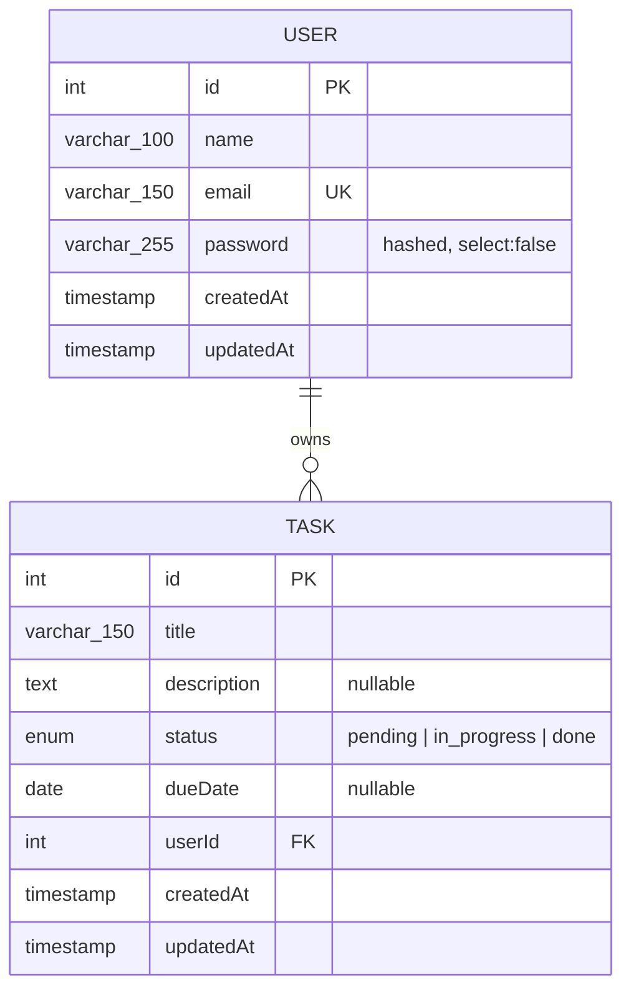

# Challenge Intern — Task Management API (Phase 1: Backend)

Express + TypeORM + MySQL REST API for user auth and per-user task management.
Frontend has **not** been started — per the phased workflow, this phase stops
once the API is running and verified.

## Contents

- [ERD](#erd)
- [Stack & version notes](#stack--version-notes)
- [Setup](#setup)
- [Environment variables](#environment-variables)
- [Migrations](#migrations)
- [Run](#run)
- [Verify](#verify)
- [Test with Postman](#test-with-postman)
- [API summary](#api-summary)
- [Design notes](#design-notes)

## ERD



One user has many tasks; a task belongs to exactly one user.
`tasks.user_id` has `ON DELETE CASCADE` — deleting a user deletes their tasks.

## Stack & version notes

Fixed stack: Node.js, Express, TypeORM, mysql2, TypeScript (strict), MySQL,
bcrypt, class-validator/class-transformer, jsonwebtoken, dotenv, cors, helmet,
express-rate-limit.

Exact resolved versions in this repo (see `package-lock.json` for the full
tree):

| Package | Version |
|---|---|
| express | 4.22.2 |
| typeorm | 0.3.31 |
| mysql2 | 3.23.2 |
| typescript | 5.9.3 |
| bcrypt | 5.1.1 |
| class-validator | 0.14.4 |
| class-transformer | 0.5.1 |
| jsonwebtoken | 9.0.3 |
| express-rate-limit | 7.5.1 |

Flagging what I was **not** certain about instead of guessing:

- **Node version**: the task says "Node.js LTS". The machine this was built on
  has **Node v25.9.0** installed, which is an odd-numbered *Current* release,
  not an LTS line (Node's even majors — 22, 24 — are the LTS ones). The app
  was built and verified against v25.9.0 and there's nothing version-specific
  in the code, but if you want to match the spec exactly, run this under
  Node 22 or Node 24 LTS (e.g. via `nvm use 22`) rather than assuming v25 is
  safe for a production deployment.
- **Express major**: pinned to Express 4.x, not the newer 5.x line. 4.x is
  what most TypeORM/class-validator tutorials and the ecosystem currently
  target; Express 5 changes some middleware/error-handling semantics that
  weren't worth the risk for a 2-day build.
- **express-rate-limit option name**: v7 accepts `max` (the long-standing
  option); a newer `limit` alias also exists in recent 7.x releases. This repo
  uses `max` since it's the one guaranteed to work across the whole 7.x line.
- **bcrypt build-time advisory**: `npm audit` reports a critical advisory in
  `tar`, pulled in transitively via `bcrypt → @mapbox/node-pre-gyp → tar`.
  It's install-time-only tooling (used to fetch/build bcrypt's native
  binary), not something reachable at runtime by this API, so it wasn't
  worth swapping `bcrypt` for `bcryptjs` and losing the native performance —
  but worth knowing it's there if your security scanning gates on `npm audit`.

## Setup

```bash
npm install
cp .env.example .env      # then edit values, see below
```

You need a running MySQL 8.x server. Two options:

**Option A — Docker (what this was verified against)**

A `docker-compose.yml` is included. It maps the container to **host port
3309** (not 3306) because 3306/3307/3308 were already in use by other local
projects on the build machine — adjust back to 3306 in both files if your
machine is free:

```bash
docker compose up -d
```

Then set in `.env`:
```
DB_HOST=localhost
DB_PORT=3309
DB_USERNAME=root
DB_PASSWORD=changeme
DB_DATABASE=challenge_intern
```

**Option B — a MySQL server you already have**

Point `.env` at it instead.

Either way, once MySQL is reachable, create the schema by running the
migration (details in [Migrations](#migrations)):

```bash
npm run migration:run
```

## Environment variables

All keys are in `.env.example`. `.env` itself is git-ignored.

| Key | Meaning |
|---|---|
| `PORT` | HTTP port the API listens on |
| `NODE_ENV` | `development` \| `production` |
| `DB_HOST`, `DB_PORT`, `DB_USERNAME`, `DB_PASSWORD`, `DB_DATABASE` | MySQL connection |
| `JWT_SECRET` | HMAC signing secret for access tokens — replace the placeholder before any real deployment |
| `JWT_EXPIRES_IN` | e.g. `1d` |
| `CORS_ORIGIN` | allowed origin for the (future) frontend |

`src/config/data-source.ts` sets `synchronize: false` — the schema is owned
entirely by the migration in `src/migrations/`, not by TypeORM inferring it
from entities at boot. You must run the migration once before starting the
app (see below); the app will connect fine but every query will fail with
"table doesn't exist" if you skip this.

## Migrations

The schema lives in `src/migrations/`, generated from the entity metadata
(`npm run typeorm -- migration:generate`, not hand-written), so it's
guaranteed to match `src/entities/*.ts` exactly. `sql/schema.sql` is kept
alongside it as a human-readable mirror of the same schema for quick review
— the migration is the one that actually runs.

```bash
npm run migration:run       # apply all pending migrations (run this after docker compose up -d)
npm run migration:revert    # roll back the most recently applied migration
npm run migration:show      # list migrations and their applied/pending status
```

After changing an entity, regenerate a new migration (never hand-edit an
already-applied one) and run it:

```bash
npm run migration:generate -- src/migrations/DescriptiveName
npm run migration:run
```

`migration:generate` diffs entity metadata against the actual connected
database, so it only produces a file when there's real drift — running it
again with nothing changed correctly refuses with "No changes in database
schema were found."

## Run

```bash
npm run build        # tsc -> dist/
npm run dev          # ts-node-dev, auto-reload, what you want while iterating
npm start             # runs the compiled dist/index.js
```

If port 3000 is already taken on your machine (it was, here — see above),
set a different `PORT` in `.env`. This repo was run and verified end-to-end
on `PORT=4000` for that reason; the Postman environment's `baseUrl` defaults
to `http://localhost:3000/api` per the spec's own default — change it to
match whatever port you actually run on.

## Verify

```bash
curl http://localhost:4000/health
# {"success":true,"data":{"status":"ok"},"message":"Service healthy"}
```

Type-check without emitting (useful in CI):

```bash
npm run lint:types
```

## Test with Postman

Import both files from `postman/`:

- `postman/collection.json` — all 8 endpoints, organized as:
  1. Auth (register, register w/ weak password [400], register w/ duplicate
     email [409], login, login w/ bad credentials [401], me)
  2. Tasks — happy path (create, list, get by id, update)
  3. Tasks — validation failures (`limit=999` [400], `page=0` [400],
     `sortBy=DROP` [400])
  4. Ownership — cross-user access (registers a second user, then attempts to
     `GET` the first user's task and asserts **404**, not 403, confirming ids
     can't be enumerated)
  5. Tasks — cleanup (delete)
- `postman/environment.json` — holds `{{baseUrl}}` and `{{token}}` (plus a
  few helper variables the test scripts populate automatically: `token2`,
  `taskId`, `primaryEmail`, `primaryPassword`, `secondaryEmail`,
  `secondaryPassword`, `userId`)

The `Login` request's test script auto-saves the returned JWT into
`{{token}}`, which every protected request then sends as
`Authorization: Bearer {{token}}`.

Run the whole thing headlessly with Newman (used to validate this build —
17 requests / 32 assertions, all passing):

```bash
npx newman run postman/collection.json -e postman/environment.json \
  --env-var "baseUrl=http://localhost:4000/api"
```

Or run it interactively in the Postman GUI: import both files, select the
environment, open the collection, click **Run** (top-to-bottom order matters
— later requests depend on variables earlier ones set).

Note the collection generates a fresh email per run
(`jane.doe.{{$timestamp}}@example.com`) for the primary registration so it's
safe to re-run repeatedly without hitting the duplicate-email case by
accident — that case is exercised deliberately in its own request instead.

## API summary

| Method | Path | Auth | Notes |
|---|---|---|---|
| POST | `/api/auth/register` | public | |
| POST | `/api/auth/login` | public | rate-limited: 5 attempts / 15 min / IP |
| GET | `/api/auth/me` | Bearer JWT | |
| GET | `/api/tasks` | Bearer JWT | paginated, filterable, sortable |
| GET | `/api/tasks/:id` | Bearer JWT | 404 (not 403) if not yours |
| POST | `/api/tasks` | Bearer JWT | |
| PUT | `/api/tasks/:id` | Bearer JWT | 404 (not 403) if not yours |
| DELETE | `/api/tasks/:id` | Bearer JWT | 404 (not 403) if not yours |

Success envelope: `{ success: true, data, message }`.
Paginated envelope: `{ success: true, data: [...], meta: { page, limit, total, totalPages, hasNextPage, hasPrevPage } }`.
Error envelope: `{ success: false, message, errors? }` — `errors` is a
field-keyed map of message arrays, present only for validation failures.

## Design notes

- **Dependency direction is one-way**: `routes → controllers → services →
  repositories → entities`. Controllers never import a repository directly;
  nothing below the controller layer imports `express`.
- **Password hashing** lives only in `src/utils/password.util.ts`
  (`bcrypt`, cost factor 12). Services call it; nothing hashes inline, and
  there's no entity hook that could double-hash on save.
- **`password` column** is `{ select: false }` on the entity, so it's
  excluded from every default `find`/`findOne`. Login explicitly re-selects
  it via `userRepository.findByEmailWithPassword` (a query builder with
  `.addSelect('user.password')`) — that's the *only* code path that ever
  reads it.
- **Login failure messages are indistinguishable**: unknown email and wrong
  password both throw the same `UnauthorizedError('Invalid email or
  password')` from `auth.service.ts`, so timing/response differences don't
  leak which one was wrong. (Note: this doesn't make the comparison
  constant-time against an attacker measuring the extra bcrypt-hash-lookup
  cost for a known-vs-unknown email; a full mitigation would hash against a
  dummy value on the not-found path too — out of scope here but worth
  flagging.)
- **Password policy** (`register.dto.ts` + `password.util.ts`): ≥12 chars,
  upper/lower/digit/special, no whitespace, rejected if it's one of the ~100
  common passwords in `password.util.ts`'s local deny-list, and rejected if
  it contains the user's email local-part or name. Each rule reports its own
  message so failures come back as a proper array under `errors.password`,
  not one blob.
- **Ownership is checked in the service layer**, not via a raw `WHERE
  userId = ?` left to chance: `taskRepository.findByIdAndUser(id, userId)`
  is the only read path task mutations go through, and a miss throws
  `NotFoundError` — a task that exists but belongs to someone else looks
  identical to a task that doesn't exist, so ids can't be enumerated.
- **Pagination**: `sortBy` is validated against a hard-coded whitelist
  (`TASK_SORTABLE_FIELDS` in `pagination-query.dto.ts`) *before* it ever
  reaches the query — `sortBy=DROP` fails validation and never gets near
  TypeORM's `order` builder, let alone raw SQL.
- **Rate limiting** is in-memory (`express-rate-limit`'s default store),
  scoped to `POST /api/auth/login` only, 5 requests / 15 minutes / IP. It
  resets on server restart — worth knowing if you're demoing the 429 and it
  doesn't trigger, or triggers earlier than expected because of prior manual
  testing in the same window.
- **Errors** all flow through `error.middleware.ts`: known `HttpError`
  subclasses render their status/message/errors as-is; anything else logs
  the stack server-side and returns a generic `{ success: false, message:
  "Internal server error" }` with status 500 — no stack trace or SQL ever
  reaches the client.
